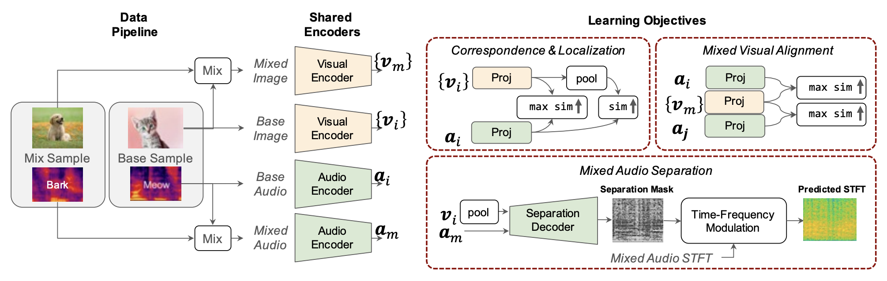

# A Unified Audio-Visual Learning Framework for Localization, Separation, and Recognition

We will release our code soon! 

OneAVM is a novel framework that can unify audio-visual joint learning for localization, separation, and recognition.

[**A Unified Audio-Visual Learning Framework for Localization, Separation, and Recognition**](https://arxiv.org/abs/2305.19458)
<br>Shentong Mo, Pedro Morgado<br>
ICML 2023.

<div align="center">
  
</div>


## Citation

If you find this repository useful, please cite our paper:
```
@inproceedings{mo2023oneavm,
  title={A Unified Audio-Visual Learning Framework for Localization, Separation, and Recognition},
  author={Mo, Shentong and Morgado, Pedro},
  booktitle={Proceedings of the 40th International Conference on Machine Learning},
  year={2023}
}
```